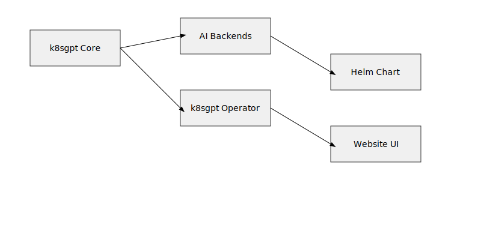

# Architecture Overview

This document provides a high‑level overview of the k8sgpt system architecture.

## Diagram

## Components

- **k8sgpt Core** – The Go binary that orchestrates AI analysis of Kubernetes resources.
- **AI Backends** – Pluggable back‑ends (OpenAI, Azure, Cohere, Ollama, Bedrock, etc.) that provide LLM capabilities.
- **k8sgpt Operator** – A Kubernetes operator that runs the core as a side‑car, watches resources, and triggers analysis.
- **Helm Chart** – Packaging for easy deployment of the operator and core components.
- **Website UI** – The Next.js website that displays analysis results, dashboards, and documentation.

The diagram above shows the data flow: the operator watches cluster resources, forwards them to the core, which calls the selected AI backend. Results are stored and optionally displayed via the UI.
