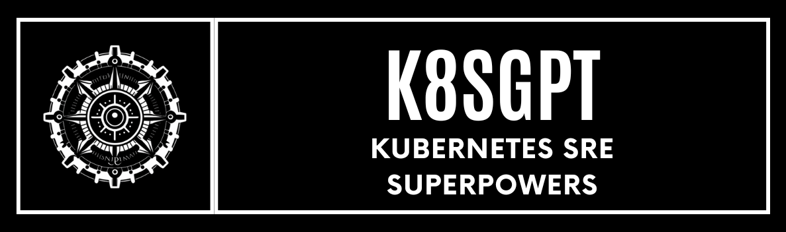
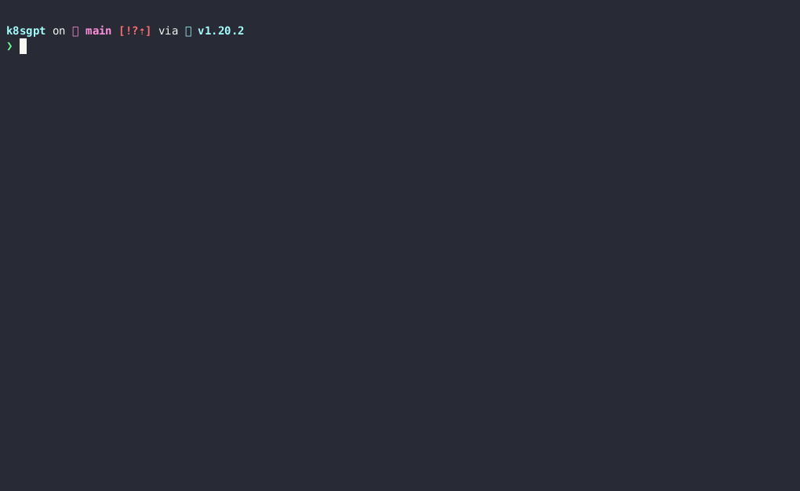

<picture>
  <source media="(prefers-color-scheme: dark)" srcset="./images/banner-white.png" width="600px;">
  
</picture>
<br/>


[](https://bestpractices.coreinfrastructure.org/projects/7272)
[](https://docs.k8sgpt.ai/)
[](https://app.fossa.com/projects/git%2Bgithub.com%2Fk8sgpt-ai%2Fk8sgpt?ref=badge_shield)
[](https://opensource.org/licenses/Apache-2.0)
[](https://github.com/k8sgpt-ai/k8sgpt)
[](https://codecov.io/github/k8sgpt-ai/k8sgpt)


`k8sgpt` is a tool for scanning your Kubernetes clusters, diagnosing, and triaging issues in simple English.

It has SRE experience codified into its analyzers and helps to pull out the most relevant information to enrich it with AI.

_Out of the box integration with OpenAI, Azure, Cohere, Amazon Bedrock, Google Gemini and local models._

<a href="https://www.producthunt.com/posts/k8sgpt?utm_source=badge-featured&utm_medium=badge&utm_souce=badge-k8sgpt" target="_blank"></a> <a href="https://hellogithub.com/repository/9dfe44c18dfb4d6fa0181baf8b2cf2e1" target="_blank"></a>




# Table of Contents
- [Overview](#k8sgpt)
- [Installation](#cli-installation)
- [Quick Start](#quick-start)
- [Analyzers](#analyzers)
- [Examples](#examples)
- [LLM AI Backends](#llm-ai-backends)
- [Key Features](#key-features)
- [Documentation](#documentation)
- [Contributing](#contributing)
- [Community](#community)
- [License](#license)

# CLI Installation

### Linux/Mac via brew

```sh
brew install k8sgpt
```

or

```sh
brew tap k8sgpt-ai/k8sgpt
brew install k8sgpt
```

<details>
  <summary>RPM-based installation (RedHat/CentOS/Fedora)</summary>

**32 bit:**

  <!---x-release-please-start-version-->

  ```
  sudo rpm -ivh https://github.com/k8sgpt-ai/k8sgpt/releases/download/v0.4.2/k8sgpt_386.rpm
  ```
  <!---x-release-please-end-->

**64 bit:**

  <!---x-release-please-start-version-->
  ```
  sudo rpm -ivh https://github.com/k8sgpt-ai/k8sgpt/releases/download/v0.4.2/k8sgpt_amd64.rpm
  ```
  <!---x-release-please-end-->
</details>

<details>
  <summary>DEB-based installation (Ubuntu/Debian)</summary>

**32 bit:**

  <!---x-release-please-start-version-->

```
curl -LO https://github.com/k8sgpt-ai/k8sgpt/releases/download/v0.4.2/k8sgpt_386.deb
sudo dpkg -i k8sgpt_386.deb
```

  <!---x-release-please-end-->

**64 bit:**

  <!---x-release-please-start-version-->

```
curl -LO https://github.com/k8sgpt-ai/k8sgpt/releases/download/v0.4.2/k8sgpt_amd64.deb
sudo dpkg -i k8sgpt_amd64.deb
```

  <!---x-release-please-end-->
</details>

<details>

  <summary>APK-based installation (Alpine)</summary>

**32 bit:**

  <!---x-release-please-start-version-->
  ```
  wget https://github.com/k8sgpt-ai/k8sgpt/releases/download/v0.4.2/k8sgpt_386.apk
  apk add --allow-untrusted k8sgpt_386.apk
  ```
  <!---x-release-please-end-->

**64 bit:**

  <!---x-release-please-start-version-->
  ```
  wget https://github.com/k8sgpt-ai/k8sgpt/releases/download/v0.4.2/k8sgpt_amd64.apk
  apk add --allow-untrusted k8sgpt_amd64.apk
  ```
  <!---x-release-please-end-->
</details>

<details>
  <summary>Failing Installation on WSL or Linux (missing gcc)</summary>
  When installing Homebrew on WSL or Linux, you may encounter the following error:

```
==> Installing k8sgpt from k8sgpt-ai/k8sgpt Error: The following formula cannot be installed from a bottle and must be
built from the source. k8sgpt Install Clang or run brew install gcc.
```

If you install gcc as suggested, the problem will persist. Therefore, you need to install the build-essential package.

```
   sudo apt-get update
   sudo apt-get install build-essential
```

</details>

### Windows

- Download the latest Windows binaries of **k8sgpt** from the [Release](https://github.com/k8sgpt-ai/k8sgpt/releases)
  tab based on your system architecture.
- Extract the downloaded package to your desired location. Configure the system _PATH_ environment variable with the binary location

## Operator Installation

To install within a Kubernetes cluster please use our `k8sgpt-operator` with installation instructions available [here](https://github.com/k8sgpt-ai/k8sgpt-operator)

_This mode of operation is ideal for continuous monitoring of your cluster and can integrate with your existing monitoring such as Prometheus and Alertmanager._

## Quick Start

- Currently, the default AI provider is OpenAI, you will need to generate an API key from [OpenAI](https://openai.com)
  - You can do this by running `k8sgpt generate` to open a browser link to generate it
- Run `k8sgpt auth add` to set it in k8sgpt.
  - You can provide the password directly using the `--password` flag.
- Run `k8sgpt filters` to manage the active filters used by the analyzer. By default, all filters are executed during analysis.
- Run `k8sgpt analyze` to run a scan.
- And use `k8sgpt analyze --explain` to get a more detailed explanation of the issues.
- You also run `k8sgpt analyze --with-doc` (with or without the explain flag) to get the official documentation from Kubernetes.

## Analyzers

K8sGPT uses analyzers to triage and diagnose issues in your cluster. It has a set of analyzers that are built in, but
you will be able to write your own analyzers.

### Built in analyzers

#### Enabled by default

- [x] podAnalyzer
- [x] pvcAnalyzer
- [x] rsAnalyzer
- [x] serviceAnalyzer
- [x] eventAnalyzer
- [x] ingressAnalyzer
- [x] statefulSetAnalyzer
- [x] deploymentAnalyzer
- [x] cronJobAnalyzer
- [x] nodeAnalyzer
- [x] mutatingWebhookAnalyzer
- [x] validatingWebhookAnalyzer

#### Optional

- [x] hpaAnalyzer
- [x] pdbAnalyzer
- [x] networkPolicyAnalyzer
- [x] gatewayClass
- [x] gateway
- [x] httproute
- [x] logAnalyzer

## Examples

_Run a scan with the default analyzers_

```
k8sgpt generate
k8sgpt auth add
k8sgpt analyze --explain
k8sgpt analyze --explain --with-doc
```

_Filter on resource_

```
k8sgpt analyze --explain --filter=Service
```

_Filter by namespace_

```
k8sgpt analyze --explain --filter=Pod --namespace=default
```

_Output to JSON_

```
k8sgpt analyze --explain --filter=Service --output=json
```

_Anonymize during explain_

```
k8sgpt analyze --explain --filter=Service --output=json --anonymize
```

<details>
<summary> Using filters </summary>

_List filters_

```
k8sgpt filters list
```

_Add default filters_

```
k8sgpt filters add [filter(s)]
```

### Examples :

- Simple filter : `k8sgpt filters add Service`
- Multiple filters : `k8sgpt filters add Ingress,Pod`

_Remove default filters_

```
k8sgpt filters remove [filter(s)]
```

### Examples :

- Simple filter : `k8sgpt filters remove Service`
- Multiple filters : `k8sgpt filters remove Ingress,Pod`

</details>

<details>

<summary> Additional commands </summary>

_List configured backends_

```
k8sgpt auth list
```

_Update configured backends_

```
k8sgpt auth update $MY_BACKEND1,$MY_BACKEND2..
```

_Remove configured backends_

```
k8sgpt auth remove -b $MY_BACKEND1,$MY_BACKEND2..
```

_List integrations_

```
k8sgpt integrations list
```

_Activate integrations_

```
k8sgpt integrations activate [integration(s)]
```

_Use integration_

```
k8sgpt analyze --filter=[integration(s)]
```

_Deactivate integrations_

```
k8sgpt integrations deactivate [integration(s)]
```

_Serve mode_

```
k8sgpt serve
```

_Analysis with serve mode_

```
grpcurl -plaintext -d '{"namespace": "k8sgpt", "explain" : "true"}' localhost:8080 schema.v1.ServerAnalyzerService/Analyze
{
  "status": "OK"
}
```

_Analysis with custom headers_

```
k8sgpt analyze --explain --custom-headers CustomHeaderKey:CustomHeaderValue
```

_Print analysis stats_

```
k8sgpt analyze -s
The stats mode allows for debugging and understanding the time taken by an analysis by displaying the statistics of each analyzer.
- Analyzer Ingress took 47.125583ms
- Analyzer PersistentVolumeClaim took 53.009167ms
- Analyzer CronJob took 57.517792ms
- Analyzer Deployment took 156.6205ms
- Analyzer Node took 160.109833ms
- Analyzer ReplicaSet took 245.938333ms
- Analyzer StatefulSet took 448.0455ms
- Analyzer Pod took 5.662594708s
- Analyzer Service took 38.583359166s
```

_Diagnostic information_

To collect diagnostic information use the following command to create a `dump_<timestamp>_json` in your local directory.
```
k8sgpt dump
```

</details>

## LLM AI Backends

K8sGPT uses the chosen LLM, generative AI provider when you want to explain the analysis results using --explain flag e.g. `k8sgpt analyze --explain`. You can use `--backend` flag to specify a configured provider (it's `openai` by default).

You can list available providers using `k8sgpt auth list`:

```
Default:
> openai
Active:
Unused:
> openai
> localai
> ollama
> azureopenai
> cohere
> amazonbedrock
> amazonsagemaker
> google
> huggingface
> noopai
> googlevertexai
> watsonxai
> customrest
> ibmwatsonxai
```

For detailed documentation on how to configure and use each provider see [here](https://docs.k8sgpt.ai/reference/providers/backend/).

_To set a new default provider_

```
k8sgpt auth default -p azureopenai
Default provider set to azureopenai
```

## Key Features

<details>

With this option, the data is anonymized before being sent to the AI Backend. During the analysis execution, `k8sgpt` retrieves sensitive data (Kubernetes object names, labels, etc.). This data is masked when sent to the AI backend and replaced by a key that can be used to de-anonymize the data when the solution is returned to the user.

<summary> Anonymization </summary>

1. Error reported during analysis:

```bash
Error: HorizontalPodAutoscaler uses StatefulSet/fake-deployment as ScaleTargetRef which does not exist.
```

2. Payload sent to the AI backend:

```bash
Error: HorizontalPodAutoscaler uses StatefulSet/tGLcCRcHa1Ce5Rs as ScaleTargetRef which does not exist.
```

3. Payload returned by the AI:

```bash
The Kubernetes system is trying to scale a StatefulSet named tGLcCRcHa1Ce5Rs using the HorizontalPodAutoscaler, but it cannot find the StatefulSet. The solution is to verify that the StatefulSet name is spelled correctly and exists in the same namespace as the HorizontalPodAutoscaler.
```

4. Payload returned to the user:

```bash
The Kubernetes system is trying to scale a StatefulSet named fake-deployment using the HorizontalPodAutoscaler, but it cannot find the StatefulSet. The solution is to verify that the StatefulSet name is spelled correctly and exists in the same namespace as the HorizontalPodAutoscaler.
```

### Further Details

Note: **Anonymization does not currently apply to events.**

_In a few analysers like Pod, we feed to the AI backend the event messages which are not known beforehand thus we are not masking them for the **time being**._

- The following is the list of analysers in which data is **being masked**:-

  - Statefulset
  - Service
  - PodDisruptionBudget
  - Node
  - NetworkPolicy
  - Ingress
  - HPA
  - Deployment
  - Cronjob

- The following is the list of analysers in which data is **not being masked**:-

  - ReplicaSet
  - PersistentVolumeClaim
  - Pod
  - Log
  - **_\*Events_**

**\*Note**:

- k8gpt will not mask the above analysers because they do not send any identifying information except **Events** analyser.
- Masking for **Events** analyzer is scheduled in the near future as seen in this [issue](https://github.com/k8sgpt-ai/k8sgpt/issues/560). _Further research has to be made to understand the patterns and be able to mask the sensitive parts of an event like pod name, namespace etc._

- The following is the list of fields which are not **being masked**:-

  - Describe
  - ObjectStatus
  - Replicas
  - ContainerStatus
  - **_\*Event Message_**
  - ReplicaStatus
  - Count (Pod)

**\*Note**:

- It is quite possible the payload of the event message might have something like "super-secret-project-pod-X crashed" which we don't currently redact _(scheduled in the near future as seen in this [issue](https://github.com/k8sgpt-ai/k8sgpt/issues/560))_.

### Proceed with care

- The K8gpt team recommends using an entirely different backend **(a local model) in critical production environments**. By using a local model, you can rest assured that everything stays within your DMZ, and nothing is leaked.
- If there is any uncertainty about the possibility of sending data to a public LLM (open AI, Azure AI) and it poses a risk to business-critical operations, then, in such cases, the use of public LLM should be avoided based on personal assessment and the jurisdiction of risks involved.

</details>

<details>
<summary> Configuration management</summary>

`k8sgpt` stores config data in the `$XDG_CONFIG_HOME/k8sgpt/k8sgpt.yaml` file. The data is stored in plain text, including your OpenAI key.

Config file locations:
| OS | Path |
| ------- | ------------------------------------------------ |
| MacOS | ~/Library/Application Support/k8sgpt/k8sgpt.yaml |
| Linux | ~/.config/k8sgpt/k8sgpt.yaml |
| Windows | %LOCALAPPDATA%/k8sgpt/k8sgpt.yaml |

</details>

<details>
There may be scenarios where caching remotely is preferred.
In these scenarios K8sGPT supports AWS S3 or Azure Blob storage Integration.

<summary> Remote caching </summary>
<em>Note: You can configure and use only one remote cache at a time</em>

_Adding a remote cache_

- AWS S3
  - _As a prerequisite `AWS_ACCESS_KEY_ID` and `AWS_SECRET_ACCESS_KEY` are required as environmental variables._
  - Configuration, `k8sgpt cache add s3 --region <aws region> --bucket <name>`
  - Minio Configuration with HTTP endpoint ` k8sgpt cache add s3 --bucket <name> --endpoint <http://localhost:9000>`
  - Minio Configuration with HTTPs endpoint, skipping TLS verification ` k8sgpt cache add s3 --bucket <name> --endpoint <https://localhost:9000> --insecure`
    - K8sGPT will create the bucket if it does not exist
- Azure Storage
  - We support a number of [techniques](https://learn.microsoft.com/en-us/azure/developer/go/azure-sdk-authentication?tabs=bash#2-authenticate-with-azure) to authenticate against Azure
  - Configuration, `k8sgpt cache add azure --storageacc <storage account name> --container <container name>`
    - K8sGPT assumes that the storage account already exist and it will create the container if it does not exist
    - It is the **user** responsibility have to grant specific permissions to their identity in order to be able to upload blob files and create SA containers (e.g Storage Blob Data Contributor)
- Google Cloud Storage
  - _As a prerequisite `GOOGLE_APPLICATION_CREDENTIALS` are required as environmental variables._
  - Configuration, ` k8sgpt cache add gcs --region <gcp region> --bucket <name> --projectid <project id>`
    - K8sGPT will create the bucket if it does not exist

_Listing cache items_

```
k8sgpt cache list
```

_Purging an object from the cache_
Note: purging an object using this command will delete upstream files, so it requires appropriate permissions.

```
k8sgpt cache purge $OBJECT_NAME
```

_Removing the remote cache_
Note: this will not delete the upstream S3 bucket or Azure storage container

```
k8sgpt cache remove
```

</details>

<details>
<summary> Custom Analyzers</summary>

There may be scenarios where you wish to write your own analyzer in a language of your choice.
K8sGPT now supports the ability to do so by abiding by the [schema](https://github.com/k8sgpt-ai/schemas/blob/main/protobuf/schema/v1/custom_analyzer.proto) and serving the analyzer for consumption.
To do so, define the analyzer within the K8sGPT configuration and it will add it into the scanning process.
In addition to this you will need to enable the following flag on analysis:

```
k8sgpt analyze --custom-analysis
```

Here is an example local host analyzer in [Rust](https://github.com/k8sgpt-ai/host-analyzer)
When this is run on `localhost:8080` the K8sGPT config can pick it up with the following additions:

```
custom_analyzers:
  - name: host-analyzer
    connection:
      url: localhost
      port: 8080
```

This now gives the ability to pass through hostOS information ( from this analyzer example ) to K8sGPT to use as context with normal analysis.

_See the docs on how to write a custom analyzer_

_Listing custom analyzers configured_
```
k8sgpt custom-analyzer list
```

_Adding custom analyzer without install_
```
k8sgpt custom-analyzer add --name my-custom-analyzer --port 8085
```

_Removing custom analyzer_
```
k8sgpt custom-analyzer remove --names "my-custom-analyzer,my-custom-analyzer-2"
```

</details>

## Documentation

Find our official documentation available [here](https://docs.k8sgpt.ai)

## Contributing

Please read our [contributing guide](./CONTRIBUTING.md).

## Community

Find us on [Slack](https://join.slack.com/t/k8sgpt/shared_invite/zt-276pa9uyq-pxAUr4TCVHubFxEvLZuT1Q)

<a href="https://github.com/k8sgpt-ai/k8sgpt/graphs/contributors">
  
</a>

## License

[](https://app.fossa.com/projects/git%2Bgithub.com%2Fk8sgpt-ai%2Fk8sgpt?ref=badge_large)