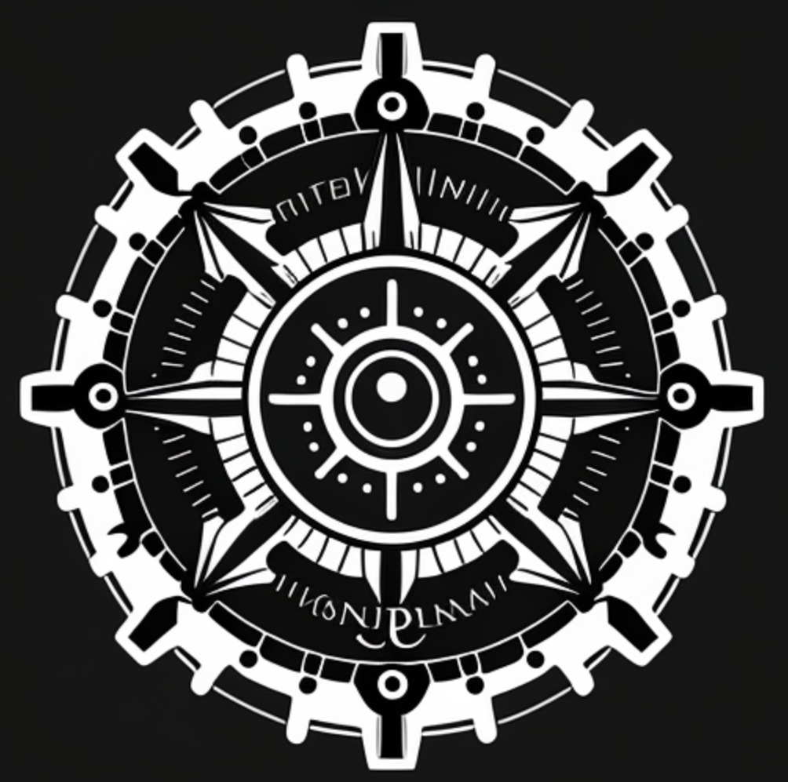
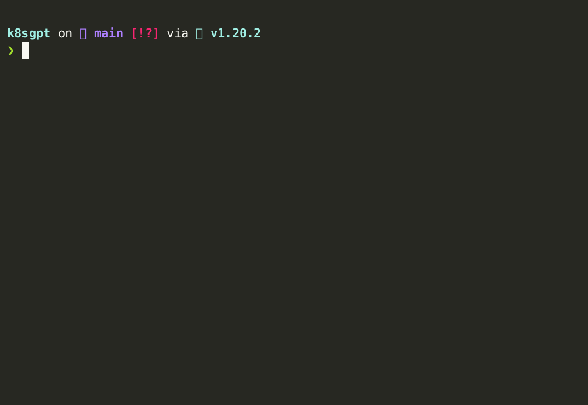

# k8sgpt

<br />
AI Powered Kubernetes debugging for SRE, Platform and DevOps teams.
<br />



## What is k8sgpt?

`k8sgpt` is a tool for scanning your kubernetes clusters, diagnosing and triaging issues in simple english.

It reduces the mystery of kubernetes and makes it easy to understand what is going on in your cluster.


## Usage

```
# Ensure KUBECONFIG env is set to an active Kubernetes cluster
k8sgpt auth key <Your OpenAI key>

k8sgpt find problems --explain

```


### Configuration 

`k8sgpt` stores config data in `~/.k8sgpt` the data is stored in plain text, including your OpenAI key.


### Example

```
❯ k8sgpt find problems --explain
default/deathstar-5b559d699b-d4jm7: Back-off pulling image "docker.io/cilium/starwaraaes"


The Kubernetes error message: Back-off pulling image "docker.io/cilium/starwaraaes" means that the Kubernetes cluster is having trouble pulling the specified container image from the Docker registry. 

To solve this issue, you can try the following:

1. Check if the specified image exists in the Docker registry by running the following command:

    `docker pull docker.io/cilium/starwaraaes`

2. If the image exists, try pulling the image manually on the node where the container is trying to run. This can be done by running the following command:

    `docker pull docker.io/cilium/starwaraaes`

3. If the image is not found in the Docker registry, check if the image name and tag are correct.

4. If the issue persists, check the Docker engine logs for any error messages that might provide more context on the issue.
placed-application-demo/placed-application-demo-58469d688c-7wdps: 0/5 nodes are available: 5 node(s) were unschedulable. preemption: 0/5 nodes are available: 5 Preemption is not helpful for scheduling..

```

## Community
* Find us on [Slack](https://cloud-native.slack.com/channels/k8sgpt-ai)
