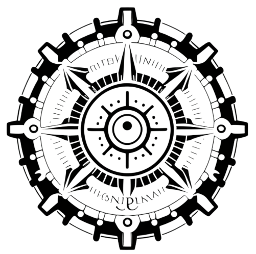
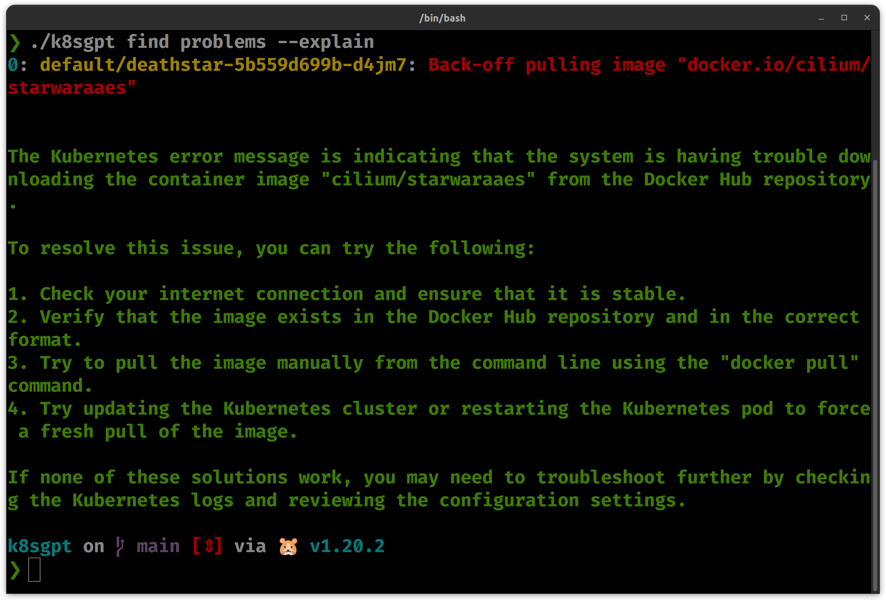

<picture>
  <source media="(prefers-color-scheme: dark)" srcset="./images/logo-white.png" width="100px;">
  
</picture>

`k8sgpt` is a tool for scanning your kubernetes clusters, diagnosing and triaging issues in simple english.

It has SRE experience codified into it's analyzers and helps to pull out the most relevent information to enrich it with AI.



## Usage

```
# Ensure KUBECONFIG env is set to an active Kubernetes cluster
k8sgpt auth key <Your OpenAI key>

k8sgpt find problems 
# for more detail
k8s find problems --explain

```

### What about kubectl-ai?

The the kubectl-ai [project](https://github.com/sozercan/kubectl-ai) uses AI to create manifests and apply them to the cluster. It is not what we are trying to do here, it is focusing on writing YAML manifests.

K8sgpt is focused on triaging and diagnosing issues in your cluster. It is a tool for SRE, Platform & DevOps engineers to help them understand what is going on in their cluster. Cutting through the noise of logs and multiple tools to find the root cause of an issue.


### Configuration 

`k8sgpt` stores config data in `~/.k8sgpt` the data is stored in plain text, including your OpenAI key.

### Community
* Find us on [Slack](https://cloud-native.slack.com/channels/k8sgpt-ai)
