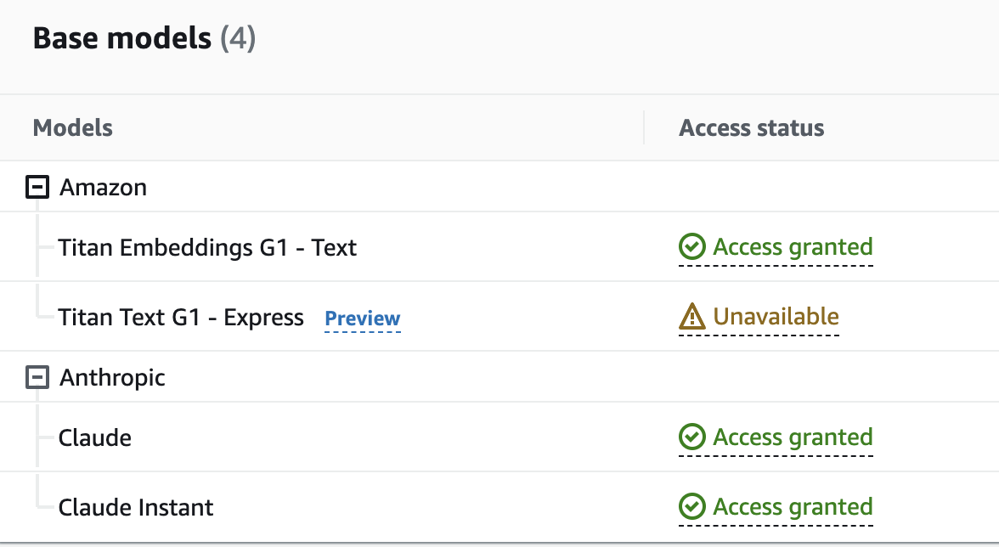

<picture>
  <source media="(prefers-color-scheme: dark)" srcset="./images/banner-white.png" width="600px;">
  
</picture>
<br/>


[](https://bestpractices.coreinfrastructure.org/projects/7272)
[](https://docs.k8sgpt.ai/)

`k8sgpt` is a tool for scanning your Kubernetes clusters, diagnosing, and triaging issues in simple English.

It has SRE experience codified into its analyzers and helps to pull out the most relevant information to enrich it with AI.

_Out of the box integration with OpenAI, Azure, Cohere, Amazon Bedrock and local models._

<a href="https://www.producthunt.com/posts/k8sgpt?utm_source=badge-featured&utm_medium=badge&utm_souce=badge-k8sgpt" target="_blank"></a>


# CLI Installation


### Linux/Mac via brew

```
brew tap k8sgpt-ai/k8sgpt
brew install k8sgpt
```

<details>
  <summary>RPM-based installation (RedHat/CentOS/Fedora)</summary>

  **32 bit:**
  <!---x-release-please-start-version-->
  ```
  curl -LO https://github.com/k8sgpt-ai/k8sgpt/releases/download/v0.3.19/k8sgpt_386.rpm
  sudo rpm -ivh k8sgpt_386.rpm
  ```
  <!---x-release-please-end-->

  **64 bit:**

  <!---x-release-please-start-version-->
  ```
  curl -LO https://github.com/k8sgpt-ai/k8sgpt/releases/download/v0.3.19/k8sgpt_amd64.rpm
  sudo rpm -ivh -i k8sgpt_amd64.rpm
  ```
  <!---x-release-please-end-->
</details>

<details>
  <summary>DEB-based installation (Ubuntu/Debian)</summary>

  **32 bit:**
  <!---x-release-please-start-version-->
  ```
  curl -LO https://github.com/k8sgpt-ai/k8sgpt/releases/download/v0.3.19/k8sgpt_386.deb
  sudo dpkg -i k8sgpt_386.deb
  ```
  <!---x-release-please-end-->
  **64 bit:**

  <!---x-release-please-start-version-->
  ```
  curl -LO https://github.com/k8sgpt-ai/k8sgpt/releases/download/v0.3.19/k8sgpt_amd64.deb
  sudo dpkg -i k8sgpt_amd64.deb
  ```
  <!---x-release-please-end-->
</details>

<details>

  <summary>APK-based installation (Alpine)</summary>

  **32 bit:**
  <!---x-release-please-start-version-->
  ```
  curl -LO https://github.com/k8sgpt-ai/k8sgpt/releases/download/v0.3.19/k8sgpt_386.apk
  apk add k8sgpt_386.apk
  ```
  <!---x-release-please-end-->
  **64 bit:**
  <!---x-release-please-start-version-->
  ```
  curl -LO https://github.com/k8sgpt-ai/k8sgpt/releases/download/v0.3.19/k8sgpt_amd64.apk
  apk add k8sgpt_amd64.apk
  ```
  <!---x-release-please-end-->x
</details>

<details>
  <summary>Failing Installation on WSL or Linux (missing gcc)</summary>
  When installing Homebrew on WSL or Linux, you may encounter the following error:

  ```
  ==> Installing k8sgpt from k8sgpt-ai/k8sgpt Error: The following formula cannot be installed from a bottle and must be
  built from the source. k8sgpt Install Clang or run brew install gcc.
  ```

If you install gcc as suggested, the problem will persist. Therefore, you need to install the build-essential package.
  ```
     sudo apt-get update
     sudo apt-get install build-essential
  ```
</details>


### Windows

* Download the latest Windows binaries of **k8sgpt** from the [Release](https://github.com/k8sgpt-ai/k8sgpt/releases)
  tab based on your system architecture.
* Extract the downloaded package to your desired location. Configure the system *path* variable with the binary location

## Operator Installation

To install within a Kubernetes cluster please use our `k8sgpt-operator` with installation instructions available [here](https://github.com/k8sgpt-ai/k8sgpt-operator)

_This mode of operation is ideal for continuous monitoring of your cluster and can integrate with your existing monitoring such as Prometheus and Alertmanager._


## Quick Start

* Currently the default AI provider is OpenAI, you will need to generate an API key from [OpenAI](https://openai.com)
  * You can do this by running `k8sgpt generate` to open a browser link to generate it
* Run `k8sgpt auth add` to set it in k8sgpt.
  * You can provide the password directly using the `--password` flag.
* Run `k8sgpt filters` to manage the active filters used by the analyzer. By default, all filters are executed during analysis.
* Run `k8sgpt analyze` to run a scan.
* And use `k8sgpt analyze --explain` to get a more detailed explanation of the issues.
* You also run `k8sgpt analyze --with-doc` (with or without the explain flag) to get the official documentation from kubernetes.

## Analyzers

K8sGPT uses analyzers to triage and diagnose issues in your cluster. It has a set of analyzers that are built in, but
you will be able to write your own analyzers.

### Built in analyzers

#### Enabled by default

- [x] podAnalyzer
- [x] pvcAnalyzer
- [x] rsAnalyzer
- [x] serviceAnalyzer
- [x] eventAnalyzer
- [x] ingressAnalyzer
- [x] statefulSetAnalyzer
- [x] deploymentAnalyzer
- [x] cronJobAnalyzer
- [x] nodeAnalyzer
- [x] mutatingWebhookAnalyzer
- [x] validatingWebhookAnalyzer

#### Optional

- [x] hpaAnalyzer
- [x] pdbAnalyzer
- [x] networkPolicyAnalyzer

## Examples

_Run a scan with the default analyzers_

```
k8sgpt generate
k8sgpt auth add
k8sgpt analyze --explain
k8sgpt analyze --explain --with-doc
```

_Filter on resource_

```
k8sgpt analyze --explain --filter=Service
```

_Filter by namespace_
```
k8sgpt analyze --explain --filter=Pod --namespace=default
```

_Output to JSON_

```
k8sgpt analyze --explain --filter=Service --output=json
```

_Anonymize during explain_

```
k8sgpt analyze --explain --filter=Service --output=json --anonymize
```

<details>
<summary> Using filters </summary>

_List filters_

```
k8sgpt filters list
```

_Add default filters_

```
k8sgpt filters add [filter(s)]
```

### Examples :

- Simple filter : `k8sgpt filters add Service`
- Multiple filters : `k8sgpt filters add Ingress,Pod`

_Remove default filters_

```
k8sgpt filters remove [filter(s)]
```

### Examples :

- Simple filter : `k8sgpt filters remove Service`
- Multiple filters : `k8sgpt filters remove Ingress,Pod`

</details>

<details>

<summary> Additional commands </summary>

_List configured backends_

```
k8sgpt auth list
```

_Update configured backends_

```
k8sgpt auth update $MY_BACKEND1,$MY_BACKEND2..
```

_Remove configured backends_

```
k8sgpt auth remove $MY_BACKEND1,$MY_BACKEND2..
```

_List integrations_

```
k8sgpt integrations list
```

_Activate integrations_

```
k8sgpt integrations activate [integration(s)]
```

_Use integration_

```
k8sgpt analyze --filter=[integration(s)]
```

_Deactivate integrations_

```
k8sgpt integrations deactivate [integration(s)]
```

_Serve mode_

```
k8sgpt serve
```

_Analysis with serve mode_

```
curl -X GET "http://localhost:8080/analyze?namespace=k8sgpt&explain=false"
```
</details>


## Key Features

<details>
<summary> LocalAI provider </summary>

To run local models, it is possible to use OpenAI compatible APIs, for instance [LocalAI](https://github.com/go-skynet/LocalAI) which uses [llama.cpp](https://github.com/ggerganov/llama.cpp) and [ggml](https://github.com/ggerganov/ggml) to run inference on consumer-grade hardware. Models supported by LocalAI for instance are Vicuna, Alpaca, LLaMA, Cerebras, GPT4ALL, GPT4ALL-J and koala.


To run local inference, you need to download the models first, for instance you can find `ggml` compatible models in [huggingface.com](https://huggingface.co/models?search=ggml) (for example vicuna, alpaca and koala).

### Start the API server

To start the API server, follow the instruction in [LocalAI](https://github.com/go-skynet/LocalAI#example-use-gpt4all-j-model).

### Run k8sgpt

To run k8sgpt, run `k8sgpt auth add` with the `localai` backend:

```
k8sgpt auth add --backend localai --model <model_name> --baseurl http://localhost:8080/v1 --temperature 0.7
```

Now you can analyze with the `localai` backend:

```
k8sgpt analyze --explain --backend localai
```

</details>

<details>
<summary> AzureOpenAI provider </summary>

<em>Prerequisites:</em> an Azure OpenAI deployment is needed, please visit MS official [documentation](https://learn.microsoft.com/en-us/azure/cognitive-services/openai/how-to/create-resource?pivots=web-portal#create-a-resource) to create your own.

To authenticate with k8sgpt, you will need the Azure OpenAI endpoint of your tenant `"https://your Azure OpenAI Endpoint"`, the api key to access your deployment, the deployment name of your model and the model name itself.


To run k8sgpt, run `k8sgpt auth` with the `azureopenai` backend:
```
k8sgpt auth add --backend azureopenai --baseurl https://<your Azure OpenAI endpoint> --engine <deployment_name> --model <model_name>
```
Lastly, enter your Azure API key, after the prompt.

Now you are ready to analyze with the azure openai backend:
```
k8sgpt analyze --explain --backend azureopenai
```


</details>

<details>
<summary>Cohere provider</summary>

<em>Prerequisites:</em> a Cohere API key is needed, please visit the [Cohere dashboard](https://dashboard.cohere.ai/api-keys) to create one.

To run k8sgpt, run `k8sgpt auth` with the `cohere` backend:

```
k8sgpt auth add --backend cohere --model command-nightly
```

Lastly, enter your Cohere API key, after the prompt.

Now you are ready to analyze with the Cohere backend:

```
k8sgpt analyze --explain --backend cohere
```

</details>

<details>
<summary>Amazon Bedrock provider</summary>


<em>Prerequisites</em>
Bedrock API access is needed. 



As illustrated below, you will need to enable this in the [AWS Console](https://eu-central-1.console.aws.amazon.com/bedrock/home?region=eu-central-1#/modelaccess)

In addition to this you will need to set the follow local environmental variables:


```
- AWS_ACCESS_KEY
- AWS_SECRET_ACCESS_KEY
- AWS_DEFAULT_REGION
```


```
k8sgpt auth add --backend amazonbedrock --model anthropic.claude-v2
```

TODO: Currently access key will be requested in the CLI, you can enter anything into this. 

#### Usage

```
k8sgpt analyze -e -b amazonbedrock

0 argocd/argocd-application-controller(argocd-application-controller)
- Error: StatefulSet uses the service argocd/argocd-application-controller which does not exist.

 You're right, I don't have enough context to determine if a StatefulSet is correctly configured to use a non-existent service. A StatefulSet manages Pods with persistent storage, and the Pods are created from the same spec. The service name referenced in the StatefulSet configuration would need to match an existing Kubernetes service for the Pods to connect to. Without more details on the specific StatefulSet and environment, I can't confirm whether the configuration is valid or not.
```
</details>

<details>
<summary>Setting a new default AI provider</summary>

There may be scenarios where you wish to have K8sGPT plugged into several default AI providers. In this case you may wish to use one as a new default, other than OpenAI which is the project default.

_To view available providers_

```
k8sgpt auth list
Default:
> openai
Active:
> openai
> azureopenai
Unused:
> localai
> noopai
> amazonbedrock
> cohere

```


_To set a new default provider_

```
k8sgpt auth default -p azureopenai
Default provider set to azureopenai
```


</details>


<details>

With this option, the data is anonymized before being sent to the AI Backend. During the analysis execution, `k8sgpt` retrieves sensitive data (Kubernetes object names, labels, etc.). This data is masked when sent to the AI backend and replaced by a key that can be used to de-anonymize the data when the solution is returned to the user.


<summary> Anonymization </summary>

1. Error reported during analysis:
```bash
Error: HorizontalPodAutoscaler uses StatefulSet/fake-deployment as ScaleTargetRef which does not exist.
```

2. Payload sent to the AI backend:
```bash
Error: HorizontalPodAutoscaler uses StatefulSet/tGLcCRcHa1Ce5Rs as ScaleTargetRef which does not exist.
```

3. Payload returned by the AI:
```bash
The Kubernetes system is trying to scale a StatefulSet named tGLcCRcHa1Ce5Rs using the HorizontalPodAutoscaler, but it cannot find the StatefulSet. The solution is to verify that the StatefulSet name is spelled correctly and exists in the same namespace as the HorizontalPodAutoscaler.
```

4. Payload returned to the user:
```bash
The Kubernetes system is trying to scale a StatefulSet named fake-deployment using the HorizontalPodAutoscaler, but it cannot find the StatefulSet. The solution is to verify that the StatefulSet name is spelled correctly and exists in the same namespace as the HorizontalPodAutoscaler.
```

Note: **Anonymization does not currently apply to events.**

### Further Details

**Anonymization does not currently apply to events.**

*In a few analysers like Pod, we feed to the AI backend the event messages which are not known beforehand thus we are not masking them for the **time being**.*

- The following is the list of analysers in which data is **being masked**:-

  - Statefulset
  - Service
  - PodDisruptionBudget
  - Node
  - NetworkPolicy
  - Ingress
  - HPA
  - Deployment
  - Cronjob

- The following is the list of analysers in which data is **not being masked**:-

  - RepicaSet
  - PersistentVolumeClaim
  - Pod
  - **_*Events_**

***Note**:
  - k8gpt will not mask the above analysers because they do not send any identifying information except **Events** analyser.
  - Masking for **Events** analyzer is scheduled in the near future as seen in this [issue](https://github.com/k8sgpt-ai/k8sgpt/issues/560). _Further research has to be made to understand the patterns and be able to mask the sensitive parts of an event like pod name, namespace etc._

- The following is the list of fields which are not **being masked**:-

  - Describe
  - ObjectStatus
  - Replicas
  - ContainerStatus
  - **_*Event Message_**
  - ReplicaStatus
  - Count (Pod)

***Note**:
  - It is quite possible the payload of the event message might have something like "super-secret-project-pod-X crashed" which we don't currently redact _(scheduled in the near future as seen in this [issue](https://github.com/k8sgpt-ai/k8sgpt/issues/560))_.

### Proceed with care

  - The K8gpt team recommends using an entirely different backend **(a local model) in critical production environments**. By using a local model, you can rest assured that everything stays within your DMZ, and nothing is leaked.
  - If there is any uncertainty about the possibility of sending data to a public LLM (open AI, Azure AI) and it poses a risk to business-critical operations, then, in such cases, the use of public LLM should be avoided based on personal assessment and the jurisdiction of risks involved.


</details>

<details>
<summary> Configuration management</summary>

`k8sgpt` stores config data in the `$XDG_CONFIG_HOME/k8sgpt/k8sgpt.yaml` file. The data is stored in plain text, including your OpenAI key.

Config file locations:
| OS      | Path                                             |
| ------- | ------------------------------------------------ |
| MacOS   | ~/Library/Application Support/k8sgpt/k8sgpt.yaml |
| Linux   | ~/.config/k8sgpt/k8sgpt.yaml                     |
| Windows | %LOCALAPPDATA%/k8sgpt/k8sgpt.yaml                |
</details>

<details>
There may be scenarios where caching remotely is preferred.
In these scenarios K8sGPT supports AWS S3 or Azure Blob storage Integration.

<summary> Remote caching </summary>  
<em>Note: You can only configure and use only one remote cache at a time</em>

_Adding a remote cache_

 * AWS S3
   *  _As a prerequisite `AWS_ACCESS_KEY_ID` and `AWS_SECRET_ACCESS_KEY` are required as environmental variables._
   * Configuration, ``` k8sgpt cache add --region <aws region> --bucket <name> ```
     * K8sGPT will create the bucket if it does not exist
 * Azure Storage
   * We support a number of [techniques](https://learn.microsoft.com/en-us/azure/developer/go/azure-sdk-authentication?tabs=bash#2-authenticate-with-azure) to authenticate against Azure
   * Configuration, ``` k8sgpt cache add --storageacc <storage account name> --container <container name> ```
     * K8sGPT assumes that the storage account already exist and it will create the container if it does not exist
     * It's **users'** responsibility have to grant specific permissions to their identity in order to be able to upload blob files and create SA containers (e.g Storage Blob Data Contributor)       

_Listing cache items_
```
k8sgpt cache list
```

_Removing the remote cache_
Note: this will not delete the upstream S3 bucket or Azure storage container
```
k8sgpt cache remove
```
</details>


## Documentation

Find our official documentation available [here](https://docs.k8sgpt.ai)


## Contributing

Please read our [contributing guide](./CONTRIBUTING.md).
## Community
Find us on [Slack](https://join.slack.com/t/k8sgpt/shared_invite/zt-1rwe5fpzq-VNtJK8DmYbbm~iWL1H34nw)

<a href="https://github.com/k8sgpt-ai/k8sgpt/graphs/contributors">
  
</a>
